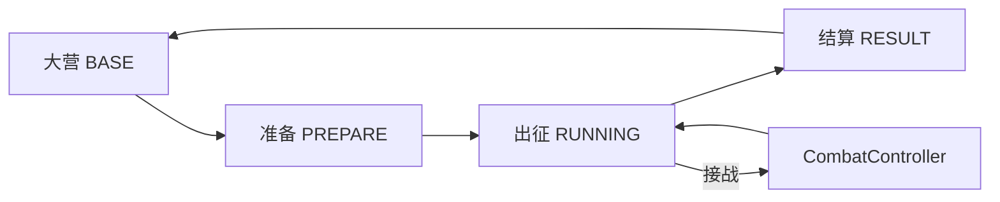

# TBH Idle RPG · 设定集（Game Bible）

> **版本：v0 初版** — 覆盖 **单局远征壳子 + 借鉴分工**；**局外成长 / 大营经营** 见 [design-meta-base.md](design-meta-base.md)（占位，待你填）。  
> **唯一总纲**：新机制、新 UI、新借鉴 **先对照本篇 + 分册**，再落到 TASK。  
> **防对话漂移**：未写入本文 / 分册 / `PROJECT_STATUS` 的 **不算定案**。  
> **最后整理**：2026-06-05  
> **引擎描述**：`2D 横版自动战斗 + 基地经营 + 佣兵撤退 RPG`（`project.godot`）

---

## 〇、一句话

**在大营整备双半组佣兵，向地图深处推进；接战自动开打，带得走的货塞进网格；稳定崩了或贪够了就撤——返程挨打掉的是外露，箱里相对安全。**

主线范式：**C 距离远征 + D 资源撤离**。  
**壳子借鉴（v2 · 见 §五）**：THB 主壳 · **KTC 跑图大地图** · **CQ 行动与自动战斗** · **提灯压力** · **塔科夫/三角洲 箱与外露**。

---

## 一、身份与边界

### 我们是什么

| 维度 | 定案 |
|------|------|
| 平台 | **PC 窗口**，鼠标优先；F1–F5 为加速器 |
| 跑图 | **KTC 式大地图推进**（改进）；领地/里程可视化；上叠自动搜索与事件（草案） |
| 行动 | **CQ 式横轴逻辑**（改进）：左营右深、停滚接战、返程左撤、前后排槽位 |
| 战斗 | **CQ 向自动战斗**（改进）：远程站桩、近战前压、投射物命中；非消块 |
| 压力 | **提灯向**：远征风险、稳定消耗、强制撤、灭团 vs 撤离成功语气 |
| 物资 | **塔科夫/三角洲向**：安全箱（绝对带出）+ 外露（可丢）+ 带货撤 |
| 编制 | **双半组 A/B**，各 4 出战 + 2 替补；本趟不换班 |
| 节奏 | 可挂机再战 / 自动连续出征；养伤锁时停 |

### 我们不是什么

| 排除项 | 说明 |
|--------|------|
| 手游 Tab 大营 | 不做底部五页切换 |
| CQ 消块战斗 | 不抄三消；战斗自动打 |
| KTC 国王走格 | 大地图学 KTC，**人物行动不学** KTC 键控 |
| 塔科夫 FPS / 硬核操作 | 只学箱与外露结构，不做射击操作 |
| 提灯式「丢光即没」 | 有安全箱；惩罚比提灯轻；双池盾缓冲 |
| 纯 Roguelike 单单局 | 有存档、大营、双半组跨趟 |
| 开放世界 SLG | 一图一条主轴 + 里程碑；非无缝大地图 |

---

## 二、空间叙事（两层地图）

### 宏观 · KTC 向大地图（跑图）

- 一图一条 **里程主轴**，可视化为 **横向领地/带状大地图**（营地 → 深处），在 KTC「推图扎营」上改进。
- 里程碑、搜索点、事件点标在 **大地图层**（`RunMarchView` / 左窗 log 协同）。
- 进军 = 版图向右展开；返程 = 向左收回。

### 微观 · CQ 向接战条（行动 + 战斗）

```
左 ←──────── 大营 / 0m / 安全          深处 / Boss / max_distance ────────→ 右
```

| 状态 | 世界距离 | 底栏接战条 |
|------|----------|------------|
| 进军 | 增加 | 大地图滚动；**接战停滚** |
| 接战 | 进军冻结 / 返程仍减 | `CombatView`：CQ 槽位、自动战斗 |
| 返程 | 减少 | 大地图左撤；盾破掉 **外露**（塔科夫感） |
| BASE | — | 营火待机 |

**铁律**：左 = 营，右 = 深。人物 **行动与战斗** 走 CQ 逻辑，**不走** KTC 国王键控。详见 [design-march-visual.md](design-march-visual.md)。

---

## 三、核心循环



### 玩家一次「出门」

1. **BASE**：选图、编组 A/B、背包/建筑、看团队稳定与养伤锁  
2. **PREPARE**：确认本趟名单、安全箱/外露预览  
3. **RUNNING**：`WorldRun` 推进距离 → 遇敌 `CombatController` → 拾取进网格  
4. **返程**（多种 reason）：向左撤、双池盾、稳定与掉物压力  
5. **RESULT**：经验、金币、掉落进背包；再战 / 回营  

### 四态铁律

`GameManager`：`BASE → PREPARE → RUNNING → RESULT → BASE`。  
**RUNNING 禁止存档**；奖励须经 `apply_run_rewards`，不得中途写入大营背包。

---

## 四、现网系统清单（2026-06-05）

### ✅ 已实现（核心可玩）

| 系统 | 要点 | 分册 |
|------|------|------|
| 属性与战斗 | `StatResolver` 唯一 final；CQ 编队/远程/近战/技能弹道 | ARCHITECTURE §一 |
| 距离远征 | `WorldRun.tick`、刷怪、地图 JSON | — |
| 返程与网格 | 安全箱/外露、双池盾、掉装、撤离点、智能带货撤 | [design-retreat.md](design-retreat.md) |
| 稳定度 | 团队 + 个人；≤30 强制返程；受击/衰减/通关扣稳定 | [design-stability-lineage.md](design-stability-lineage.md) |
| 濒死与伤痕 | DOWNED、70% 出战、搀扶、医疗室、绝境觉醒 | [design-near-death.md](design-near-death.md) |
| Boss 追击 | 返程追击、蓄力击退、击杀=区域通关 | [design-boss-chase.md](design-boss-chase.md) |
| 双半组与养伤锁 | 4+2、再战、自动补员、A/B 皆不可出战则锁 | [design-expedition-meta.md](design-expedition-meta.md) |
| PC 主壳 | 三窗 + 底栏 Run + Dock；四态切槽 | [design-pc-shell.md](design-pc-shell.md) |
| 战斗表现 | `CombatView` / 槽位坐标 `BattlefieldSlots` | [design-march-visual.md](design-march-visual.md) |
| 存档 / 地图解锁 | 槽位 JSON、基地等级门槛 | SAVE_FORMAT, MAP_UNLOCK |
| 测试图 | F5 场景注入、稳定/撤离/Boss 线 | TEST_SCENARIOS |

### 🟡 进行中 / 勉强可用

| 系统 | 状态 |
|------|------|
| CQ 横版条 | V1 状态机有占位；**视差/跑图 V2+ 未做**；战斗单位对齐刚修，观感仍占位 |
| 大营 UI | B1 地图卡部分交付；B1.5 Dock/选中分离进行中 |
| 建筑深度 | 医疗/仓库等部分接线；研究所转生等待做 |

### 📋 已定案未做 / 可选

| 系统 | 说明 |
|------|------|
| 接战锚点 `party_anchor_x` | T-RUN-V3；战斗坐标与世界里程统一 |
| 大营 B2–B4 | 顶栏稳定条、编组舞台、大营背包网格 |
| 街景/CQ 大营美术 | design-pc-shell 标为后期 |
| 稳定档位事件 / 掉物飞溅 | design-stability-lineage §可选 |
| **跑图自动搜索 + 事件** | 机制方向已定；见 [design-march-events.md](design-march-events.md)；排 TASK 前不实现 |

---

## 五、壳子五源 v2（暂定 **唯一** 对外借鉴）

> **2026-06-05 修订**：按职责拆分——**KTC 管大地图跑图**，**CQ 管行动与战斗**，**提灯管压力**，**塔科夫/三角洲管箱与外露**；**DD 退出壳子参考**（现网稳定系统过渡期仍可用，机制目标向提灯靠拢）。  
> **暂停**：RimWorld、城建类等不得再当作壳子参考，除非 CTO 修订本篇。

| # | 来源 | **负责什么** | 不借什么 | 适合度 | 落点 |
|---|------|--------------|----------|--------|------|
| 1 | **THB 原版** | PC **主壳**：上三窗 + Dock + 底栏分区；右窗网格；四态 | 2-7 关卡、9 合 1 合成主轴 | ✅ | [design-pc-shell.md](design-pc-shell.md) |
| 2 | **Kingdom: Two Crowns** | **跑图大地图**：横向领地推进、扎营/里程感、返程版图左收；自动搜索/事件锚点 | 国王键控、金币即主资源、横版走格战斗 | ⚠️ 宏观地图；在 KTC 上改进 | `RunMarchView`、左窗地图、[design-march-events.md](design-march-events.md) |
| 3 | **克鲁赛德战记 CQ** | **人物行动 + 自动战斗**：前后排、停滚接战、左撤、远程/近战/弹道；接战条槽位 | 消块、CQ 街景大营 | ⚠️ 微观行动；在 CQ 上改进 | `CombatController`、`CombatView`、`RunMarchLane` 接战态 |
| 4 | **提灯与地下城** | **压力机制**：远征风险、稳定/士气消耗、贪险、强制撤、撤离 vs 灭团 | 重度丢光、复杂房间探索、操作硬核 | ⚠️ 机制向提灯靠拢 | `StabilitySystem`、返程 reason、文案；[design-stability-lineage.md](design-stability-lineage.md) |
| 5 | **塔科夫 / 三角洲行动** | **安全箱 vs 外露**：二维占格、带货撤、外露可丢、结算才进大营 | FPS、部位伤害、局外市场全包 | ⚠️ 物资层 | `GridInventory`、`design-retreat.md`、[design-loot-lineage.md](design-loot-lineage.md) |

### 职责分工（防混用）

| 问题 | 问谁 | 不问谁 |
|------|------|--------|
| 大地图怎么长、里程碑怎么标？ | **KTC** | CQ、塔科夫 |
| 接战谁前排、怎么自动打？ | **CQ** | KTC |
| 什么时候必须撤、压力从哪来？ | **提灯** | DD |
| 这件货会不会丢、放箱还是外露？ | **塔科夫/三角洲** | KTC 掉金币 |
| 窗口怎么分、网格在哪？ | **THB** | — |

### 壳子合成示意图

```
┌─ THB 上区 ─────────────────────────────────┐
│  左：地图卡 + KTC 向里程/里程碑信息           │
│  中：编组  右：塔科夫向 箱/外露 网格预览      │
├─ THB 底栏 ─────────────────────────────────┤
│  【KTC 层】跑图大地图 / 搜索·事件（改进）     │
│  【CQ 层】接战条 CombatView（行动+自动战斗）  │
│  【提灯】稳定/价值/撤离压力条与文案           │
│  【塔科夫】返程盾破 → 外露掉落反馈            │
├─ THB Dock ─────────────────────────────────┤
└────────────────────────────────────────────┘
```

### 五源一句话

| 源 | 一句话 |
|----|--------|
| THB | 上管下打，物资网格在右 |
| KTC | **版图在推，不是在走格** |
| CQ | **接战条里队伍自动打，停滚开战** |
| 提灯 | **压力逼你撤，不是 DD 城镇** |
| 塔科夫/三角洲 | **箱里算你的，外露不算** |

**玩法自研**：双半组、双池盾、Boss 追击、伤痕觉醒、跑图自动搜索与事件（草案）。

---

## 六、机制主轴（简表）

| 主轴 | 玩家问题 | 关键规则 |
|------|----------|----------|
| **距离** | 走多远？ | `max_distance`、`boss_distance`、`extract_distance` |
| **压力** | 还能不能扛？（**提灯向**） | 团队 ≤30 强制撤；个人 ≤30 崩溃；远征衰减与受击加压 |
| **网格** | 带多少、放哪？（**塔科夫/三角洲向**） | 安全箱绝对带出；外露可丢；价值达标智能撤 |
| **护盾** | 返程怎么护货？ | 装备盾 → 物资盾 → 盾破概率掉外露 |
| **濒死** | 人没死透怎么办？ | DOWNED、搀扶、70% 再战、伤痕、觉醒 |
| **编制** | 谁下一趟？ | A/B 4+2；养伤锁；主角战略位不占槽（方向） |
| **追击** | Boss 追不追？ | `chase_pressure`；返程加密；蓄力击退 |

返程 reason 全集：`manual` / `forced` / `auto_value` / `auto_rule` / `combat_fail` / `extract_*` — 见 [design-retreat.md](design-retreat.md) §二。

---

## 七、情绪与呈现

| 时刻 | 目标情绪 | 手段 |
|------|----------|------|
| 进军 | 推进、可控 | 距离涨、稳定缓掉 |
| 接战 | 紧张但不用手操 | 自动战斗 log + 色块表现 |
| 贪包 | 风险上升 | 外露变满、价值条、稳定下降 |
| 返程 | 慌而不虐 | 向左、盾条、掉物 log |
| 抵营 | 解脱 / 惋惜 | 结算档、稳定备注、养伤锁 |
| 大营 | 整备、规划 | 三窗、地图卡、编组槽 |

**避免**：无解释的即死丢档；进军接战时距离偷偷涨；返程画面向右。

---

## 八、文档地图（按主题，不重复造轮子）

| 主题 | 文档 |
|------|------|
| **本篇总纲** | **GAME_BIBLE.md**（你正在读） |
| 任务与排期 | [PROJECT_STATUS.md](PROJECT_STATUS.md) |
| 架构铁律 | [ARCHITECTURE.md](ARCHITECTURE.md) |
| 玩法分册索引 | [DESIGN_INDEX.md](DESIGN_INDEX.md) |
| 压力机制血统（提灯向） | [design-stability-lineage.md](design-stability-lineage.md) |
| 箱与外露血统（塔科夫/三角洲） | [design-loot-lineage.md](design-loot-lineage.md) |
| 返程 / 网格 / 盾 | [design-retreat.md](design-retreat.md) |
| 濒死 / 伤痕 / 觉醒 | [design-near-death.md](design-near-death.md) |
| Boss 追击 | [design-boss-chase.md](design-boss-chase.md) |
| 再战 / 半组 / 养伤锁 | [design-expedition-meta.md](design-expedition-meta.md) |
| CQ 横版视觉 | [design-march-visual.md](design-march-visual.md) |
| 跑图搜索与事件 | [design-march-events.md](design-march-events.md) |
| PC 壳 / 四态 | [design-pc-shell.md](design-pc-shell.md) |
| 大营 UI 线 | [design-base-ui.md](design-base-ui.md) |
| **局外成长 / 经营（初版占位）** | [design-meta-base.md](design-meta-base.md) |
| QA | [TEST_SCENARIOS.md](TEST_SCENARIOS.md)、[TEST_PLAYBOOK.md](TEST_PLAYBOOK.md) |
| 存档字段 | [SAVE_FORMAT.md](SAVE_FORMAT.md) |

**会话规则**：PM → [PM_RULES.md](session_rules/PM_RULES.md)；开发 → [FEATURE_DEV_RULES.md](session_rules/FEATURE_DEV_RULES.md)；Bug → [BUGFIX_RULES.md](session_rules/BUGFIX_RULES.md)。

---

## 九、下一篇章（v1 预告 · 未写定案）

| 篇章 | 状态 | 文档 |
|------|------|------|
| **局外成长 · 角色** | 猎杀向经验构筑（§3.5） | [design-meta-base.md](design-meta-base.md) §3.4–§3.5 |
| **失败掉人** | 猎杀+鸭科夫：MIA→主城三路回收；仅放弃搜寻永久没（已定案） | [design-failure-lineage.md](design-failure-lineage.md) |
| **大营经营** | 待你填想法 | 同上 §3.2 |
| 经营类借鉴 | 空白表 | 同上 §3.3（**不占用** §五 跑图五源） |

**v0 只管**：一趟出征怎么跑、怎么撤、怎么装货、怎么加压。  
**v1 再管**：多趟之间大营玩什么、成长曲线、经营主循环。

---

## 十、待决清单（讨论可记，未记 TASK 不做）

| 话题 | 状态 |
|------|------|
| 主角是否永久不占 A/B 槽 | 方向已定，实现见 T-02c / 养伤锁相关 TASK |
| KTC 大地图美术 | T-RUN-V2+；在 KTC 气质上改进，非复刻像素 |
| CQ 街景大营 | **不做** |
| 稳定档位触发行为事件 | 血统文档标可选 |
| 返程后段降低掉物概率 | 可选 |
| 研究所 / 转生玩法 | 数据在，玩法未接 |

**新增壳子借鉴**：本篇 §五 **仅五源**；要加第六源须 CTO 改 Bible。机制玩法走分册 + TASK，不挂外游戏壳子名。

---

## 十一、快速自检（新想法 30 秒）

1. 是否强化 **C 远征 + D 撤离**？否则偏题。  
2. 是否破坏 **左营右深** 或 **箱安全 / 外露险**？  
3. 是否让 UI 在 RUNNING **盖住上管三窗**？THB 壳不允许。  
4. 是否需改 `ARCHITECTURE` 铁律（属性流、存档、tick 分层）？需单独立项 TASK。  
5. 是否已在 **§四 已实现** 里重复造轮子？

---

## 修订记录

| 日期 | 说明 |
|------|------|
| 2026-06-05 | 首版：身份、借鉴图谱、现网清单、文档地图 |
| 2026-06-05 | 壳子 v1：THB / CQ / DD / 提灯 / KTC |
| 2026-06-05 | **壳子 v2**：KTC=大地图跑图，CQ=行动+战斗，提灯=压力，塔科夫/三角洲=箱外露；DD 移出 |
| 2026-06-05 | 标定 **v0 初版**；新增 design-meta-base 局外/经营占位 |
| 2026-06-05 | 局外角色成长：**猎杀对决**；经验主闸 §3.5 定案 |
