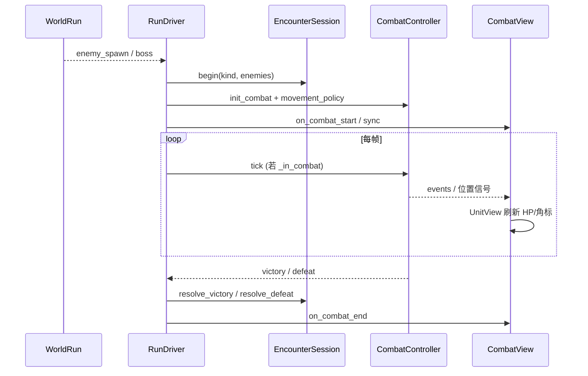

# 战斗子系统地图（Combat Stack）

> **状态**：架构对齐文档 · 2026-06-06  
> **用途**：开发/评审前「理战斗」——接战类型、tick 顺序、文件索引、TASK 边界。  
> **铁律**：见 [ARCHITECTURE.md](ARCHITECTURE.md) §一、§三；产品见 [GAME_BIBLE.md](GAME_BIBLE.md) §二微观 CQ 条。

---

## 一、战斗在五层中的位置

```
⑤ RunDriver          开/关接战 · world_run_ticked 门禁
④ EncounterSession   类型 · 胜败出口 · 距离是否冻结
   CombatMovementPolicy   进军/返程/追击走位
   CombatController       tick：技能/Buff/普攻/濒死
   CombatEntity           场上副本（只读 StatResolver 快照）
⑤ CombatView / UnitView  只订阅 · 不改伤害
② Mercenary.buff_system  Buff 权威在 merc
② StatResolver           最终属性唯一入口
```

**禁止**：`CombatController` 内 `boss_chase` / `is_chase_encounter` 分支；`CombatView` 调 `tick()`。

---

## 二、接战类型表（EncounterKind）

| Kind | 典型来源 | 世界距离 | 移动策略 | 胜/败出口 |
|------|----------|----------|----------|-----------|
| **MARCH_ADVANCE** | 进军刷怪 | 进军接战 **冻结** | `AdvanceMovementPolicy` | `resolve_victory` → 继续进军 |
| **MARCH_RETREAT** | 返程刷怪 | **继续减少** | `RetreatDriftMovementPolicy` | 败 → `emergency_retreat` |
| **CHASE_BOSS** | 追击追上 | **冻结** | `ChaseBossMovementPolicy` | 胜 → repel 或 end_run；败 → chase_defeat |
| **BOSS_LANE** | 区域首领 | 进军冻结 | Advance | 败 → combat_fail 撤向撤离点 |
| **EXTRACT_GUARD** | 拾取撤离物 | 进军冻结 | Advance | 胜 → end_run 直接结算 |

推断：`EncounterSession.infer_kind()`（`encounter_session.gd`）。  
追加刷怪：`allows_pending_append()` — **CHASE_BOSS 为 false**（M1 探针）。

---

## 三、单次接战生命周期



**RunDriver 门禁**：

- `world_run_ticked = (返程 or 未接战) and not gather_active`
- 进军接战：不 tick WorldRun 距离（与 RunMarchLane 停滚一致）

---

## 四、CombatController.tick 顺序（单帧）

| 步 | 内容 | 文件/备注 |
|----|------|-----------|
| 1 | 压力濒死同步 | `_sync_pressure_downed_allies` |
| 2 | 友方 Buff tick + 技能 CD | `buff_system.tick` → `recalc_from_merc` |
| 3 | 友方移动 | `_movement_policy.tick_ally` |
| 4 | 敌方移动 | `_movement_policy.tick_enemy` |
| 5 | 弹道 | `CombatProjectileSystem.tick` |
| 6 | 胜负 | fighting 计数 · 追击濒死处决 grace |
| 子步 | 实体攻击 | `_entity_tick` → 普攻 / `CombatSkillExecutor` |

觉醒单位：走 `NearDeathAwakeningService.tick_combat`，再 `_entity_tick`。

---

## 五、状态 → 权威字段 → UI

| 玩家所见 | 权威 | UI 组件 |
|----------|------|---------|
| HP 条 | `CombatEntity.current_hp` | `UnitView` |
| 名称 `(濒死)` | `entity.is_downed()` | `UnitView.sync_status_from_entity` |
| 名称 `(觉醒·*)` | `merc.is_awakening` + variant | T-06 角标 |
| Buff 角标 | `merc.buff_system.active_buffs` | T-06 `_refresh_buff_badges` |
| 技能 CD 角标 | `entity` 技能 CD 快照 | T-03 青/橙角标 |
| `[远]` | `entity.is_ranged_unit()` | 名称后缀 |
| 位置 X | `CombatEntity.position` + `BattlefieldSlots` | `CombatView._sync_one_unit_position` |

脚线：`CombatView.UNIT_BASELINE_Y` · 锚点：`party_anchor_x`（T-RUN-V3）。

---

## 六、战斗相关 TASK 与边界

| ID | 管什么 | 状态 | 不动 |
|----|--------|------|------|
| **T-REFACTOR-M1** | 接战门禁、CHASE 不插队 | ✅ | — |
| **T-02a** | 濒死目标/后排归位 | ✅ | 伤害公式 |
| **T-06** | Buff/觉醒头标 | ✅ F5 | Controller |
| **T-03** | 技能 CD + active_skills | ✅ 逻辑 | 走位大改 |
| **T-04** | BattleDebug 测试模式 | ✅ 逻辑 | 正式伤害 |
| **T-02c** | 主角留营/纯佣兵出征 | ✅ 逻辑 | 战斗公式 |
| **T-01** | 套装 → StatResolver | ✅ 逻辑 | — |
| **T-02** | 远程后排调参 | ⏸ 封 | — |
| **T-02b** | 像素/槽位统一 | P2 | — |

**推荐顺序**：F5 收 T-01/03/04/02c → 内容/平衡 → 再开 T-02 或新技能。

---

## 七、文件索引

| 职责 | 路径 |
|------|------|
| 驱动 | `scripts/run/run_driver.gd` |
| 接战会话 | `scripts/run/encounter_session.gd` |
| 接战类型 | `scripts/run/encounter_kind.gd` |
| 移动策略 | `scripts/combat/combat_movement_policy.gd` |
| 战斗主循环 | `scripts/combat/combat_controller.gd` |
| 技能 | `scripts/combat/combat_skill_executor.gd` |
| 弹道 | `scripts/combat/combat_projectile_system.gd` |
| 实体 | `scripts/combat/combat_entity.gd` |
| 槽位映射 | `scripts/combat/battlefield_slots.gd` |
| 表现 | `scripts/ui/combat_view.gd` · `unit_view.gd` |
| Buff | `scripts/buff/buff_system.gd` |
| 属性 | `scripts/stats/stat_resolver.gd` |
| 濒死/觉醒 | `scripts/run/near_death_run_service.gd` · `near_death_awakening_service.gd` |
| 测试模式 | `scripts/combat/battle_debug.gd` |
| 配置 | `data/skill_templates.json` · `enemy_templates.json` |

---

## 八、F5 快速验收（战斗包）

| 图 | 验什么 |
|----|--------|
| **test_01** | 接战停滚 · 搜索不接战 · 技能角标（T-03） |
| **test_06** | 濒死站位（T-02a） |
| **test_08** | 觉醒名/头标（T-06）✅ |
| **test_03** | 追击接战无插队 · 距离冻结（环1） |
| 任意接战 | 底栏「测试 OFF/ON」（T-04） |

大营：**T-02c** 纯佣兵出征 · **T-01** 套装 N/M 与 DEF 同步。

---

## 相关文档

- [design-march-visual.md](design-march-visual.md) — 接战停滚与锚点
- [design-near-death.md](design-near-death.md) — 濒死/觉醒
- [UI_SUBSYSTEM_AUDIT.md](UI_SUBSYSTEM_AUDIT.md) — UI 缺口（部分已过时）
- [PROJECT_STATUS.md](PROJECT_STATUS.md) — 探针表 T-02a～T-06
