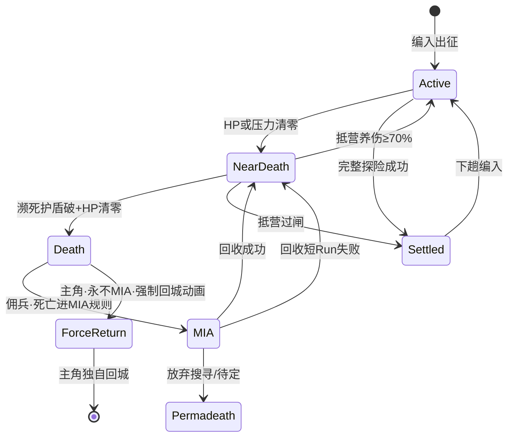

# 失败掉人 · 设计血统（猎杀对决 + 逃离鸭科夫）

> **状态：机制定案（问答完成）— 待拆 TASK / 数值表 / 补给点与压力实现**  
> **CTO 实现对照** → **[design-failure-lineage-CTO.md](design-failure-lineage-CTO.md)**（冲突矩阵、分期、现网落点）  
> **关联**：[design-meta-base.md](design-meta-base.md) §3.4–§3.7、[design-near-death.md](design-near-death.md)、[design-loot-lineage.md](design-loot-lineage.md)、[design-retreat.md](design-retreat.md)  
> **职责分工**：猎杀管 **「人是有价 Build，最终可以没」**；鸭科夫管 **「第一次失败不立刻删，给一次专趟回收」**。TBH 映射为 **佣兵状态**，不是照搬猎人/鸭子 literal。

---

## 一、两作各贡献什么

### 1.1 猎杀：对决 — 掉人的「重量」

| 机制 | 玩家感受 | TBH 借什么 |
|------|----------|------------|
| **猎人 = 持久构筑** | 等级、特质、天赋都绑在 **有名的人** 上 | 与 §3.4 成长方向一致；**没掉的不只是 HP，是 Build 投资** |
| **出征配装** | 带进图的装丢了很痛 | 已有箱/外露（loot-lineage）；与人 **同趟绑定** |
| **撤离成功才踏实** | 局内涨的 XP 要 **撤出** 才算数 | 已定 **完整探险结算闸**（§3.5） |
| **猎人可永久没** | 失败不是「回城养伤」就完事，是 **名册里少一个人** | 仅 **放弃搜寻** → `mark_permanent_death`；**回收失败 / 恶化 2 趟 ≠ 永久没** |
| **无跑尸** | 死了就是死了，没有第二次进图捡人 | **不借** — 由鸭科夫补回收窗 |

猎杀回答：**为什么要怕掉人**（构筑沉没成本 + 经验池可能冻住）。

### 1.2 逃离鸭科夫 — 掉人的「节奏」

| 机制 | 玩家感受 | TBH 借什么 |
|------|----------|------------|
| **角色不删，包先丢** | 挫败在物资，不在删号 | 映射为 **MIA（战场遗留）**，名册仍可见 |
| **跑尸** | 再进图到死亡点 **捡包** | **回收出征** — 专趟或同图分支捞人 |
| **二次死亡** | 回收途中再死 → **上一包永久没** | **不照搬**：回收出征失败 → 捞人队濒死+伤痕 + 发放 **回城卷轴类**（见 §五） |
| **安全箱** | 箱内死亡不掉 | **安全箱 + 未上场替补** |
| **PvE + 可选回档** | 比塔科夫/猎杀柔和 | **v1 不做**本趟回档；以后研究所/道具单次回溯（B-9） |

鸭科夫回答：**第一次重大失败后怎么给后悔药**，且后悔药本身有风险。

### 1.3 合体一句话

> **猎杀**：有价 Build + 经验按 MIA 人数冻结。  
> **鸭科夫**：死亡→MIA→主城 **短 Run / 一键 / 大价值复活** 多档捞人；捞失败发卷轴。  
> **TBH**：抵营算过闸；主角永不 MIA；**仅放弃搜寻永久没**；拖捞恶化 2 趟→地图点消失但仍可主城复活。

与塔科夫层：**外露** 挂遗物点，随拖捞衰减；**箱内** 始终安全（loot-lineage）。

---

## 二、TBH 三层失败（合体定案）

### 2.0 死亡逻辑顺序（已定 · 2026-06-05）

```
正常战斗
  → 生命值 或 压力值 清零
  → 【濒死】强制保留 1 HP + 1 压力 + 特殊机制护盾
  → 濒死状态下护盾被击破 且 HP 再次清零
  → 【死亡】
  → 进 MIA 规则（佣兵；主角例外见 B-3h）
```

| 阶段 | 规则 |
|------|------|
| **进濒死** | HP 清零 **或** 压力清零（压力=副生命值） |
| **濒死维持** | 锁 **1 HP + 1 压力** + **特殊护盾**；可搀扶、可觉醒、可换人 |
| **死亡** | 濒死态下 **护盾击破** 后再 **HP 清零** |
| **死亡后** | **直接走 MIA 规则**（非先永久没） |

**与旧现网差异**：现网 HP→0 即濒死；合体后需补 **压力清零进濒死**、**濒死护盾**、**二段死亡→MIA**。

```
┌─────────────────────────────────────────────────────────────┐
│ L1 · 濒死（未死亡）                                          │
│ HP/压力清零 → 濒死(1HP+1压力+护盾)；可搀扶/返程/抵营养伤      │
│ 人：不 MIA；经验：仍参与本趟池（若最终过闸）                  │
└───────────────────────────┬─────────────────────────────────┘
                            │ 本趟未过「完整探险结算闸」
                            ▼
┌─────────────────────────────────────────────────────────────┐
│ L2 · MIA（战场遗留）                                          │
│ 触发：§6.2（灭团全员 / 撤离失败比例 / 死亡二段式 / 压力概率…）   │
│ is_mia；遗物点 + 经验按人数冻结；名册可见不可编入               │
└───────────────────────────┬─────────────────────────────────┘
                            │ 主城回收 §五：短Run / 一键 / 大价值
                            ▼
              成功 · 失败 · 拖捞恶化 · 放弃搜寻
              25%经验  卷轴   2趟地图点没  永久没
```

### 2.1 L1 与 L2 分界（关键）

| 场景 | 现网 | 合体后 |
|------|------|--------|
| 战中 HP/压力清零 | 濒死（1HP+1压力+护盾） | **已定 §2.0** |
| 濒死护盾破 + HP 再清零 | （现网无此档） | **死亡 → MIA 规则** |
| 战败但 **跟队返程抵营** | 濒死 + 养伤 | **定案** — 算 **成功过闸**，仅养伤锁；不进 MIA |
| **灭团**（`_mark_squad_wiped`） | 全员 `mark_permanent_death` | → **参战者进 MIA**（已定 §6.2 B-1） |
| **撤离失败**（团队压力撤离后未抵营） | 部分永久没 | → **B-3a/b 比例** MIA（B-3f） |
| **手动斩仓** | 等同战败 | **不进 MIA**；短程减轻惩罚（B-8） |
| 替补 **未实际上场** | 安全 | 可濒死/压力换人顶场（B-2） |

**原则**：只要本趟仍以「抵营结算」结束且人跟回来了，走 L1；**没过结算闸且人落在图上**，走 L2。

### 2.2 L2 → 回收 → L3（猎杀终点）

| 阶段 | 人 | 物 | 经验（§3.5） |
|------|-----|-----|----------------|
| 进入 MIA | `is_mia=true`，不可 `can_join_squad` | 参战 **外露** 挂战场遗物点；箱内回大营 | 冻结比例 **按 MIA 人数占上场人数** 计算 |
| 回收 **成功**（短 Run 抵点 / 读条一键） | 清 MIA；`enter_near_death_state` + 伤痕；养伤 | 遗物点 **部分** 带回 | 可取回经验 = 正常结算的 **25%** |
| 回收短 Run **失败** | **MIA 仍在**；捞人队濒死+伤痕，**不永久没** | 遗物点不变；当次捞人队外露按返程规则 | 仍冻结；发 **回城卷轴类** |
| **放弃搜寻** | ✅ `mark_permanent_death`（构筑沉没） | 遗物清空 | 冻结 **归零** |
| **恶化 2 趟未捞** | 地图 MIA 消失；主城 **大价值复活仍可用** | 地图遗物 **消失** | 仍按 B-6 |
| 完整探险 **成功** | 无人 MIA | 箱+外露按现规则 | 全池入账 |

**回城卷轴类**：回收出征失败后发放；可在主城对 **仍 MIA 的批次** 做 **读条一键回收**，**资源代价低于** 无卷轴时的普通一键回收。

---

## 三、状态机（实现对照）

### 3.1 建议 merc 状态（在现网字段上扩展）

| 状态 | 字段（现网 / 建议） | 可出征 | 说明 |
|------|---------------------|--------|------|
| 正常 | `is_alive && !is_near_death && !is_mia` | ✅ | 现网 |
| 濒死 | `is_near_death`（1HP+1压力+濒死护盾） | ❌ | L1 |
| **MIA / 战场遗留** | **`Mercenary.is_mia`**（CTO：字段在每人；濒死护盾破或收场批量） | ❌ | L2；名册 `[遗留]` |
| 永久死亡 | `!is_alive` | ❌ | `mark_permanent_death`；L3 |

**不重叠**：进 MIA 时清濒死标记；永久没时清 MIA。

### 3.2 流程图



### 3.3 与现网代码锚点（定案后改）

| 现网 | 合体后演进 |
|------|------------|
| `main.gd` `_mark_squad_wiped` → 全员 `mark_permanent_death` | → **`Mercenary.is_mia` + `enter_mia_state`**（CTO 已定 Phase 1 第一刀） |
| `mercenary.gd` `mark_permanent_death` | 保留；触发源：**放弃搜寻**（B-5）；不含回收失败 / 恶化 2 趟 |
| `can_join_squad()` | 增加 `is_mia` 拦截 |
| `design-near-death` 濒死返程 | **保留** L1；与 MIA **互斥** |
| `apply_run_rewards` | 分支：成功 / MIA 冻结 / 回收补发 / 永久没清零 |

**定案前**：代码仍走现网；本文仅设计。

---

## 四、与猎杀成长 / 经验闸联动

| 猎杀逻辑 | TBH 合体 |
|----------|----------|
| 局内涨 XP，撤出带走 | 局内累积池；**完整探险成功** 才全入账 |
| 猎人死了，这趟 XP 白费 | 冻结按 **MIA 人数比例**；放弃搜寻/永久没 **清零** |
| 回收相当于「低风险再赌一次成长」 | 回收成功仅 **25%** 正常经验 + 人回营；失败不删人 |

**构筑痛感**：高等级、多特质佣兵 MIA 时，UI 强调 **沉没等级/特质**（猎杀味）；回收出征 UI 标 **一次后悔药**（鸭科夫味）。

---

## 五、主城回收功能（已定案 · 2026-06-05）

**落点**：大营 **主城** 设专用 **回收功能**（建筑或后勤入口，具体 UI 落点后续 TASK）；不依赖大地图常开。

**挫败兜底（B-11c-1）**：主城 **留存 MIA 记录**；忘操作或无战斗编队时仍可 **大价值复活**。

玩家对每批 **MIA** 可选 **三条回收路**（+ 放弃搜寻）：

### 5.1 通道 A · 回收出征（独立短 Run）

| 项 | 定案 |
|----|------|
| 形式 | **独立短 Run**：短里程、直奔遗物点 |
| 难度 | **低于** 正常远征（敌人/压力/里程弱化） |
| 编队 | 玩家自派 **新队伍**；**不可编入 MIA 本人** |
| 胜利 | **抵达遗物点即胜**（无需守点战） |
| 失败 | 见 §5.4 — **不永久没** |

### 5.2 通道 B · 读条一键回收（较低价）

| 项 | 定案 |
|----|------|
| 形式 | 主城 **消耗资源 + 读条** 直接结算捞人 |
| 代价 | **低于** 大价值复活；持有 **回城卷轴**（短 Run 失败后发放）再减价 |
| 遗物/经验 | 同 §5.5 成功规则；受 B-11a 拖捞衰减 |

### 5.3 通道 C · 大价值复活（兜底 · 随时可用）

| 项 | 定案 |
|----|------|
| 时机 | **一有 MIA 即可**（B-11c-2） |
| 代价 | **显著高于** 短 Run / 读条一键 |
| 场景 | 忘操作、无战斗编队、地图点已消失（B-11c）均可 |
| 结果 | 清 MIA 回营；遗物按当时衰减档；经验按 B-6 |

### 5.4 回收出征失败（与鸭科夫链式永久没脱钩）

| 项 | 定案 |
|----|------|
| MIA 本人 | **仍为遗留**，不清 MIA |
| 当次捞人队 | **低血 / 濒死 + 伤痕**（回营养伤），**不** `mark_permanent_death` |
| 掉落物 | 遗物点 **保持**；捞人队外露按现网返程/战败规则 |
| 补偿道具 | 发放 **回城卷轴类**：用于 §5.2 一键 **减价**（消耗品，绑批） |
| 经验 | 本趟冻结池 **继续冻结**（不解冻、不清零） |

### 5.4.1 双半组互捞（B-10）

| 项 | 定案 |
|----|------|
| 触发 | **A 队 MIA** 后，**B 队** 下次出征 **自动带回收目标**（反之亦然） |
| 捞取再失败 | **去捞的第二队不留 MIA**（濒死/伤痕 + 卷轴）；**原 MIA 批仍在** |
| 主城 | 回收 UI 仍可手动选 **短 Run / 读条一键**；卷轴 **绑批** |

### 5.5 回收成功（短 Run / 一键 / 大价值 · 共用）

| 项 | 定案 |
|----|------|
| MIA 本人 | 清 MIA；**濒死 + 伤痕**；养伤锁 |
| 外露 | 及时捞：部分带回；拖 **1 趟** 后随机 **50–70%**；拖 **2 趟** 后 **20–30%**（B-11a） |
| 经验 | 可取回 = 正常结算 **25%**（B-6） |

### 5.6 放弃搜寻

| 项 | 定案 |
|----|------|
| 结果 | `mark_permanent_death`；遗物清空；冻结经验归零（B-5） |

### 5.7 救援队（第三队 · 已定案方向 · 2026-06-05）

> **动机**：专队 **避战捞人**；与 A/B 互捞 **并存**；形成 **「互捞轻罚 / 救援重罚」** 梯度，避免只有一条路。

#### 定案要点

| 项 | 定案 |
|----|------|
| **解锁** | 局外解锁（救援站 / 研究所 — 建筑节点 TASK 待定） |
| **编制** | **第三队**专职救援 Run；**不可**正常推图远征 |
| **跑图** | **避战救援**：绕开战斗节点，直奔 MIA 坐标 |
| **遗物** | **默认不带**；**特殊天赋 / 科技** 解锁时可 **例外带出**（弱化量） |
| **成功奖励** | **救援额外经验** → 同时涨 **救援队等级** + **救援声望**（与 B-6 冻结池 **分开**） |
| **成功结果** | **只带回尸体** → **停尸间待医疗**复活；**地图 MIA 点随运尸清除**（遗物一并没） |
| **尸体留存** | 停尸间待医疗；**TTL 暂不设定**（后续版本再定） |
| **与 B-10** | **保留** A/B 互队自动捞；救援队为 **并行选项**，非替代 |

#### 回收路全景

```
地图 MIA
  ├ §5.1 / B-10  A/B 战斗队短 Run（互捞·轻罚）
  ├ §5.7        救援队避战 Run（重罚）
  ├ §5.2 读条一键
  ├ §5.3 大价值复活
  └ §5.6 放弃搜寻 → 永久没
```

#### 惩罚梯度（B-12 · 已定方向）

| 维度 | A/B 互捞短 Run（**轻罚**） | 救援队避战（**重罚**） |
|------|---------------------------|------------------------|
| 编制代价 | 占用 **战斗半组** | 专用第三队，不抢 A/B 推图档期 |
| 跑图风险 | 低难，**可能接战** | **避战**为主，专跑尸体 |
| 本趟冻结经验 | 可回收 **25%**（B-6） | **不取** B-6 池（仅救援额外经验） |
| 遗物 | **部分带回**（拖捞衰减 B-11a） | **默认不带**；天赋/科技例外 |
| 地图点 | 清 MIA；遗物按衰减 | **运尸即清点**（人+遗物均没） |
| 回城形态 | **濒死 + 伤痕**，直接养伤链 | **停尸间尸体** → **医疗复活**（多一步） |
| 失败 | 捞人队不留 MIA + 卷轴 | **救援队不留 MIA**；队员进入 **养伤 CD**（原地图 MIA **仍在**） |
| 适合 | 想 **少亏**、顺便捞货 | 愿 **多付代价** 换 A/B 不分心 |

#### 设计收益

1. **双梯惩罚**：互捞 = 战斗队顺带、损失小；救援 = 省心但 **货没了 + 医疗二段 + 无 B-6**。  
2. **B-10 保留**：仍有互捞；救援队不是唯一解。  
3. **成长双线**：救援队等级 + 救援声望，支撑天赋/科技 **例外带货**。  
4. **猎杀味**：停尸间 + 医疗复活，Build 仍沉成本。

#### B-12 拍板记录

| # | 定案 |
|---|------|
| B-12a | **默认不带遗物**；**天赋 / 科技** 可例外带出 |
| B-12b | **停尸间待医疗** 复活 |
| B-12c | **保留 B-10 互捞**；与救援队 **并存**；互捞轻罚、救援重罚 |
| B-12d | 尸体运走 → **地图 MIA 点跟着清**（遗物没） |
| B-12e | **救援队等级 + 救援声望** 都要 |
| B-12f | **救援队失败** | ✅ **不留 MIA**；队员进 **养伤 CD**；**原地图 MIA 批仍在** |
| B-12g | **停尸间 TTL** | ⏸ **暂不设定** |

### 5.7.1 救援队出征失败（B-12f）

| 项 | 定案 |
|----|------|
| 救援队队员 | **不进 MIA**；进入 **养伤 CD**（不可再出征直至 CD 结束） |
| 原地图 MIA | **仍在**；可改由 A/B 互捞、一键、大价值或 **养伤 CD 结束后** 再派救援队 |
| 卷轴 | 救援队失败 **不发** 回城卷轴（卷轴绑 **战斗队** 短 Run 失败，§5.4） |
| 重罚体现 | 白跑一趟 + 救援队停摆；地图 MIA 与遗物衰减链 **继续** |

---

## 六、拍板记录

### 6.0 通读速查（一张图）

```
【局内】HP/压力清零 → 濒死(1+1+护盾) ─抵营→ 过闸养伤(L1)
                    └护盾破+HP清零→ 死亡 → MIA(L2) [主角→回城动画,永不MIA]

【进 MIA】战场灭团 → 上场全员 MIA
         撤离失败 → 按濒死比例 B-3a/b（压力算完好度）
         压力收场 → 轻判人数 + 个人状态二次判定（团队先→撤离事件）
         手动斩仓 → 不进 MIA(B-8)

【出 MIA】A/B互捞短Run(轻罚) / 救援队(重罚) / 一键 / 大价值
         互捞 → 25%经验+部分遗物+濒死回营
         救援队 → 仅尸体+救援等级/声望；停尸间待医疗；地图点随清
         短Run失败 → 捞人队不留MIA + 卷轴
         放弃搜寻 → 永久没
         拖2趟(过补给点计) → 地图点消失，主城仍可大价值复活
```

### 6.1 场景定案摘要

| 场景 | 你的结论 |
|------|----------|
| **A · 抵营全员濒死** | 算 **完整探险成功过闸**，仅养伤锁；不进 MIA |
| **C · 返程 / 撤离** | **撤成抵营 = 成功过闸养伤**；**撤不成未抵营 = MIA 链**（见 B-3e）；返程改版 + 未来场景/AOE 见 §九 |
| **D · 回收入口** | **主城回收功能**；**短 Run 自派队** + **读条一键** 双通道 |
| **D · 短 Run** | 低里程、直达遗物点、到了即赢；**难度低于正常远征** |
| **E · 回收成功** | 清 MIA；濒死+伤痕；外露 **部分** 带回；经验 **解冻一部分** |
| **F · 回收出征失败** | **本批 MIA 不死亡**；捞人队濒死+伤痕；发 **回城卷轴类**（一键回收更便宜） |
| **B-1 · 战场灭团** | 上过场者 **全员 MIA**（不分比例） |
| **B-3g · 灭团/撤离分叉** | 灭团全员 MIA；撤离失败才走 B-3a/b |
| **B-2 · 参战者边界** | 替补可濒死换人上场；未上场者不进 MIA |
| **B-3a · 全员濒死** | 场上全员濒死且未抵营 → 上过场者进 MIA |
| **B-3b · 大部分濒死** | 濒死者进 MIA；幸存者不进 MIA，判濒死或伤痕 |
| **B-3c · 压力收场** | 压力=副生命值；团队收场→撤离事件；概率 MIA 见 B-3c 抽法 |
| **B-3e · 撤离结果** | 抵营=过闸养伤；未抵营=撤离失败 |
| **B-3f · 撤离失败 MIA** | 按濒死比例 B-3a/b；压力计入完好判定 |

### 6.2 MIA 触发与回收（问答定案）

| # | 情形 | 定案 |
|---|------|------|
| B-1 | **战场灭团**（未走团队撤离事件、未抵营） | ✅ **上过场者全员进 MIA**，**不分** B-3a/b 比例 |
| B-2 | **谁算「参战者」** | ✅ 替补 **两条上场条件**：① 队友濒死；② **某单位压力机制触发**时也可入场替换。未实际上场者不进 MIA |
| B-3a | **全员濒死 + 未抵营** | ✅ 上过场者 **进 MIA** |
| B-3b | **大部分濒死 + 未抵营**（例：4 人里 3 人濒死、1 人还能打） | ✅ **濒死者进 MIA**；**还能打的那 1 人** 不进 MIA，改判 **濒死或伤痕**（具体叠层实现时定） |
| B-3c | **压力收场**（稳定过低、强制撤失败、**单人/团队**压力触顶等） | ✅ 压力视为 **另一种生命值**：一般不致死，主要 **削弱正常战斗力**；成员 **概率 MIA** + 物品 **概率丢失** |
| B-3c-抽法 | 压力收场 **判定链** | ✅ **两阶段**（单人/团队均适用）：① **轻判定** → 定大概几人 MIA；② **按单位状态二次判定** — 综合 **完好度、身上增益/减益、生命值（含压力值）** 加权点名 |
| B-3c-未中签 | 二次判定 **未进 MIA** 者 | ⏳ 待定（见 §6.2 B-3d）；倾向由压力伤害体现为 **战力削弱 / 伤痕类减益**，而非一律濒死 |
| B-3c-单人 | **单人压力触顶** | ✅ **不立刻收场**：有替补则 **自动换人** + **换人读条/特殊动画**；被换下者 **缓慢恢复压力值**，未恢复够前 **战力很弱**，但可放 **增益/减益技能（效果减半）** |
| B-3c-编制 | 场上战力人数节奏 | ✅ 约 **3→2→3**（换人窗口期有效战力下降，恢复后再满编） |
| B-3d | **团队压力收场** | ✅ 先做 **轻判定**；场上 **大概率无完好单位** → **触发撤离事件**（本趟进入撤离流程，非当场 MIA 结算） |
| B-3e | **撤离事件结果** | ✅ **撤成抵营** → **过闸养伤**；**撤不成未抵营** → **撤离失败**，走 **B-3a/b**（B-3f，非战场灭团全员） |
| B-3f | **撤离失败 → MIA 规则** | ✅ **A**：看 **濒死比例** — 全员濒死 → **B-3a**；大部分濒死 → **B-3b**。**压力视作副生命值**，计入「完好/濒死」状态判定（高压力/压力见底视同重伤档） |
| B-3g | **战场灭团 vs 撤离失败** | ✅ 灭团 → **全员 MIA**（B-1）；撤离失败未抵营 → **B-3a/b 比例**（B-3f） |
| B-3h | **主角** | ✅ **永不 MIA**；死亡 → **回城动画**（见 B-3i / B-3i-1） |
| B-3h-1 | **主角强制回城时队友** | ✅ **B**：主角独自回城；**佣兵留场上**，按 **当时收场规则** 单独结算（可 MIA） |
| B-4 | **死亡逻辑顺序** | ✅ HP/压力清零→濒死(1+1+护盾)→护盾破+HP清零=**死亡**→**进 MIA** |
| B-3i | **主角死亡** | ✅ **永不 MIA**。佣兵 **全死** → 立刻 **特殊动画 + 独自回城** |
| B-3i-1 | **主角死亡 + 场上仍有佣兵** | ✅ **佣兵撤离成功** → 主角 **同时** 触发回城动画，**不进 MIA**；**佣兵撤离失败** → 主角 **仍** 触发回城动画，**不进 MIA**。佣兵按 B-3e/f/B-1 单独结算 |
| B-5 | **放弃搜寻** | ✅ `mark_permanent_death`；遗物清空；冻结经验归零 |
| B-6 | **经验冻结/取回** | ✅ 冻结量按 **MIA 人数占上场人数**；回收成功可取回 = 正常 **25%** |
| B-7 | **回城卷轴** | ✅ **消耗品**；一次一张；**绑该批 MIA**；用于一键回收减价 |
| B-8 | **手动斩仓** | ✅ **不进 MIA**；视同战败撤场，濒死/伤痕/掉外露，**人全回大营**；**本趟进程不长** → 惩罚 **减轻或免除** |
| B-9 | **本趟快照回档** | ✅ **v1 不做**；后续 **研究所 / 稀有道具** 提供 **单次回溯到本趟出发前** |
| B-10 | **多批 MIA / 双半组互捞** | ✅ **A 队 MIA 后，B 队默认自动捞**（反之亦然）。**捞取再失败**：去捞队 **不留 MIA**；原批仍在 |
| B-10a | **B 队改打正常远征** | ✅ **允许**；A 批恶化：**遗物衰减 → 2 趟后地图点消失**（**非**自动永久没） |
| B-11 | **恶化时间轴** | ✅ 约 **2 趟**（5–10 分/趟）；**过补给点后**抵营或撤离失败各算 1 趟（B-11b） |
| B-11a | **跳过捞时的遗物衰减**（第二队来捞时） | ✅ MIA 本身已有 **经验惩罚 + 物品掉落**。未捞 **第 1 趟** 后再捞 → 遗物仅 **随机 50–70%** 可取；**第 2 趟** 后再捞 → 仅 **随机 20–30%** 可取 |
| B-11b | **恶化「计趟」规则** | ✅ **过补给点后** 本趟结束 → **算 1 趟**（**抵营** 或 **撤离失败** 均算）；**未到补给点** → **不计趟**；到站 **自动补给** ≠ 提前撤离 |
| B-11c | **计满 2 趟仍未捞** | ✅ **地图 MIA 消失**；遗物没；人 **非永久没** |
| B-11c-1 | **主城留存 MIA / 大价值复活** | ✅ **减挫败兜底**：玩家 **忘记操作** 或 **无战斗力编队** 去回收时，主城 **仍留存该批 MIA**；可用 **大价值复活** 捞人（意图：不逼玩家立刻双队互捞） |
| B-11c-2 | **大价值复活时机** | ✅ **随时可用** — 一有 MIA，主城即可 **花大钱捞**；短 Run / 读条一键 / 卷轴为 **低价路** |
| B-12 | **救援队第三队** | ✅ 避战；停尸间；运尸清图；等级+声望；**与 B-10 并存·重罚** |
| B-12f | **救援队失败** | ✅ 不留 MIA；**养伤 CD**；原 MIA 仍在 |
| B-12g | **停尸间 TTL** | ⏸ 暂不设定 |

### 6.3 实现时待定（不阻塞定案）

| 话题 | 说明 |
|------|------|
| B-3c 未中签者减益 | 压力收场未进 MIA → 战力削弱/伤痕类（公式后续） |
| B-3b 幸存者 | 「濒死或伤痕」叠层择一实现 |
| 大价值 / 一键 **具体资源价** | 数值表 TASK |
| 50–70% / 20–30% **随机规则** | 按件还是按批、是否加权 |
| 补给点 **地图配置** | 与 KTC 大地图 TASK 绑定 |
| 压力轻判定 / 二次判定 **公式** | 与 StabilitySystem TASK 绑定 |
| 救援队 **养伤 CD 时长** | B-12f 已定机制；数值 TASK |
| 停尸间 **TTL** | B-12g 暂不设定 |

**TASK 已登记**：[PROJECT_STATUS.md](PROJECT_STATUS.md) §**T-MIA** — `T-MIA-0`～`T-MIA-4`（Phase 1），`T-MIA-P2`～`P4`（后续）。

---

## 九、撤离途中威胁分层（建议 · 对齐「少出现打赢撤不出」）

> 现网：返程中 **优先不攻开撤离护盾单位**（单体索敌）。后续可能有 **场景伤害、AOE、特殊索敌**。原则：**单体友好、环境可避、MIA 只看抵营结果**。

### 9.1 三层威胁

| 层 | 类型 | 建议行为 | 对 MIA 的影响 |
|----|------|----------|----------------|
| **L-单体** | 普攻 / 单体技能 | **维持**低优先打护盾单位；打其他人 | 不直接 MIA；濒死/掉盾/掉外露 |
| **L-环境** | 场景伤害、地刺、落石 | **预告 + 车道/列结算**；优先扣 **团队稳定 / 压力**，其次 HP | 不单独触发 MIA |
| **L-机制** | AOE、标记狙击、冲锋 | **必须预告**；AOE 全员受影响但 **盾/装备层先吃**；标记可换位化解 | 加剧濒死；**仅未抵营** 才进 MIA 链 |

### 9.2 与双池盾 / 掉物

- **盾未破**：不掉外露（延续 [design-retreat.md](design-retreat.md)）。  
- **盾破**：仅 **外露概率丢失**（可与 B-3c 压力收场掉物共用轻判定，**撤离途中与 MIA 分开_roll**）。  
- **场景/AOE** 建议 **不走单体索敌表**，走独立 `retreat_environmental_tick`，避免「护盾完全无敌」也避免「无故全灭」。

### 9.3 与团队压力撤离事件

```
团队压力收场 → 轻判 → 触发撤离事件 → 返程/撤离专用路程
    ├ 途中：L-单体 / L-环境 / L-机制 可叠加，但应有保底推进（缩短里程或撤离点）
    ├ 抵营 → 成功过闸（B-3e）· 养伤
    └ 未抵营（**撤离失败**）→ **B-3f**：按濒死比例走 B-3a / B-3b（压力计入状态）
```

### 9.3.1 撤离失败（定义 · 已定）

**撤离失败** = 团队压力触发 **撤离事件** 后，本趟 **未抵营** 收场（与途中挨打、盾破、掉物、途中濒死 **不等价**；**抵营即成功**，哪怕全员濒死）。

| 不是撤离失败 | 是撤离失败 |
|--------------|------------|
| 撤离途中战斗败、盾破、掉外露 | 撤离流程结束且 **未抵营** |
| 有人濒死但仍推到抵营 | 推进停止 / 强制收场，没回大营 |

### 9.4 设计底线（建议默认）

1. **打赢了默认能撤出去** — 团队压力撤离应用 **缩短路程** 或 **专用撤离点**，不是换皮灭团。  
2. **未来硬核伤害靠预告** — 玩家输在给盾、走位、稳定，不是暗骰。  
3. **MIA 闸门仍是「未抵营」** — 途中再惨，抵营就算过闸（对齐场景 A）。

---

## 七、不借什么

| 不借 | 原因 |
|------|------|
| 鸭科夫 **回收再死→包永久没** | TBH 改为 **回收失败不删人 + 卷轴减价一键** |
| 猎杀 **回收失败即猎人没** | 永久没仅 **放弃搜寻**（B-5） |
| 鸭科夫 **尸体包 literal** | TBH 掉的是 **人+外露**；箱内已安全 |
| PvP 式一次清档 | PvE 远征 + 养伤锁节奏 |

---

## 八、修订记录

| 日期 | 说明 |
|------|------|
| 2026-06-05 | 初稿：鸭科夫调研 + TBH 映射提案 |
| 2026-06-05 | **合体定案**：猎杀 stakes + 鸭科夫 MIA/回收/链式；三层失败、状态机、落地锚点 |
| 2026-06-05 | **用户拍板**：抵营=成功过闸；主城双通道回收；短 Run 低难抵点即胜；成功=部分外露+部分解冻；失败=不删 MIA+卷轴 |
| 2026-06-05 | **MIA B-1/B-2**：收场→场上者 MIA；替补可动态上场，未上场者安全 |
| 2026-06-05 | **MIA B-3a**：全员濒死+未抵营 → 上过场者进 MIA |
| 2026-06-05 | **MIA B-3b**：大部分濒死 → 濒死者 MIA，幸存者濒死/伤痕 |
| 2026-06-05 | **MIA B-3c**：压力收场 → 概率 MIA + 概率掉物；替补可因单位压力入场 |
| 2026-06-05 | **MIA 抽法**：轻判定定人数 → 二次判定（状态+增减益+HP/压力） |
| 2026-06-05 | **压力框架**：压力收场视作副生命值，单人/团队同判定链 |
| 2026-06-05 | **单人压力**：替补自动换人+读条；换下者缓回压力，弱战力但半效辅助技；3-2-3 人数节奏 |
| 2026-06-05 | **团队压力**：轻判 → 大概率无完好单位 → 触发撤离事件 |
| 2026-06-05 | **B-3e**：撤离成=过闸养伤；撤不成=MIA 链；§九 途中威胁分层建议 |
| 2026-06-05 | **B-3f**：撤离失败=未抵营；MIA 按 B-3a/b，压力计入状态判定 |
| 2026-06-05 | **B-3g**：战场灭团=上过场全员 MIA；与撤离失败分叉 |
| 2026-06-05 | **B-3h**：主角永不 MIA；死亡→特殊动画强制回城 |
| 2026-06-05 | **B-3h-1**：主角独自回城；佣兵留场按当时规则结算 |
| 2026-06-05 | **B-4**：濒死二段式 — 1HP+1压力+护盾 → 死亡 → MIA |
| 2026-06-05 | **B-3i/B-3i-1**：主角永不 MIA；全死立刻回城；有佣兵则随撤离成败同步回城 |
| 2026-06-05 | **B-5**：放弃搜寻 → 永久没 + 冻结归零 |
| 2026-06-05 | **B-6**：经验冻结按 MIA 人数比；回收成功取回 25% |
| 2026-06-05 | **B-7**：回城卷轴=消耗品，绑批 MIA，一键减价 |
| 2026-06-05 | **B-8**：手动斩仓不进 MIA；短程惩罚减轻/免除 |
| 2026-06-05 | **B-9**：本趟回档 v1 不做；以后研究所/道具单次回溯 |
| 2026-06-05 | **B-10**：双半组互自动捞 MIA；捞失败二队不留 MIA |
| 2026-06-05 | **B-11**：恶化链约 2 趟；提前撤离计入未捞次数 |
| 2026-06-05 | **B-11a**：拖 1 趟捞剩 50–70% 物；拖 2 趟剩 20–30% 物 |
| 2026-06-05 | **B-11b**：过补给点后抵营/撤离失败各算 1 趟；未到站不计 |
| 2026-06-05 | **B-11c**：2 趟未捞→地图 MIA 消失；主城大价值复活 |
| 2026-06-05 | **B-11c-1**：主城留存 MIA 兜底；忘操作/无编队时可大价值复活 |
| 2026-06-05 | **B-11c-2**：大价值复活随时可用；短Run/一键/卷轴为低价路 |
| 2026-06-05 | **通读修订**：消矛盾（B-10a/计趟/三路回收/§6.0 速查）；meta 同步 |
| 2026-06-05 | **§5.7 提案**：救援队第三队·避战·只捞尸体·长留存·救援额外经验 |
| 2026-06-05 | **B-12 定案**：救援队重罚梯度；互捞保留轻罚；停尸间；等级+声望 |
| 2026-06-05 | **B-12f/g**：救援队失败→养伤CD不留MIA；停尸间TTL暂缓 |
| 2026-06-05 | **CTO 工程定案**：is_mia@Mercenary；WorldRun 模式；rescue_squad；account_meta 冻结 |
