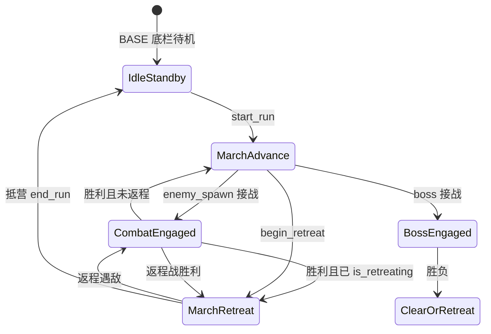

# 出征 / 撤退可视化（KTC 大地图 + CQ 接战条）

> **状态：Sprint 可视化专题** — T-RUN-V1 → V5。见 `PROJECT_STATUS.md`。  
> **壳子 v2**（[GAME_BIBLE.md](GAME_BIBLE.md) §五）：**KTC** = 跑图大地图；**CQ** = 接战条行动与自动战斗表现。  
> **玩法不变**：`WorldRun` / `CombatController` 数值铁律不动（ARCHITECTURE §三）。  
> **关联**：[design-march-events.md](design-march-events.md)、[design-pc-shell.md](design-pc-shell.md)。

---

## 一、用户定案

### 宏观 · KTC 向大地图（v2 壳子）

- 跑图主视觉 = **横向领地/带状大地图**（在 KTC 推图上改进）；里程碑、搜索/事件标在图上。
- V2 `RunMarchView` 服务此层；与下文 CQ 接战条 **叠放**，非二选一。

### 微观 · CQ 向接战条（三项）

| # | 选择 | 含义 |
|---|------|------|
| 1 | **接战停滚** | 进军接战时大地图/距离 **停滚**；底栏切 `CombatView` |
| 2 | **返程向左** | 非战斗返程 + 返程接战，版图/队伍表现 **向左撤** |
| 3 | **进军接战距离暂停** | `distance_traveled` 进军接战期间不增加 |

---

## 二、空间隐喻（与 CQ 一致）

```
左 ←──────── 大营 / 安全 (0m)          深处 / Boss ────────→ 右 (max_distance)
```

| 视觉 | 世界层 | 战斗层 |
|------|--------|--------|
| 向右跑 | `is_retreating == false` 且未接战 | — |
| 停步 | 进军接战开始 | `CombatController.is_active` |
| 向左跑 | `is_retreating == true` 且未接战 | 返程接战：世界继续左移 + 友方 `_drift_homeward` |

**左 = 营，右 = 深。** 所有 UI 文案与滚动方向不得违背此轴。

---

## 三、三层架构（实现边界）

```
Layer 1 · 世界层 RunMarchLane
  - 读 WorldRun：distance_traveled, is_retreating, max_distance
  - 输出：scroll_x, party_anchor_x, lane_state
  - 禁止：改伤害、改掉落、改 Mercenary base 属性

Layer 2 · 接战层（现有 CombatController）
  - 进军接战：世界 tick 暂停（见 §四）
  - 返程接战：世界 tick 继续（边撤边走，CQ 返程战）
  - 坐标：CombatEntity.position 锚定在 party_anchor_x + 槽位偏移

Layer 3 · 表现层 RunMarchView + CombatView
  - 同一底栏画布；按 lane_state 切换「行军」与「接战」
  - 只订阅信号 / 读快照；不实现命中、CD、胜负
```

与 [ARCHITECTURE.md](ARCHITECTURE.md)：**UI 不复制战斗规则**；**CombatView 不改 CombatEntity 数值**。

---

## 四、运行状态机



### 各状态 · 世界层 · 表现层

| 状态 | `distance_traveled` | 背景滚动 | 队伍画面 |
|------|---------------------|----------|----------|
| **MarchAdvance** | `+= advance_speed * dt` | 向右（近景快） | 剪影/小人向右跑 |
| **CombatEngaged（进军）** | **暂停** | **停止** | 停步；`CombatView` 接战 |
| **MarchRetreat** | `-= retreat_speed * dt` | 向左 | 剪影向左跑 |
| **CombatEngaged（返程）** | **继续减少**（边撤边走） | **向左**（可略慢） | `CombatView` + 友方左漂 |
| **IdleStandby** | — | 不滚 | 营火/「选择地图出征」 |

### 现网对照（`main.gd` L92）

```gdscript
var world_run_ticked: bool = run.is_retreating or not _in_combat
```

| 场景 | 现网 | 定案 | 动作 |
|------|------|------|------|
| 进军 + 未接战 | tick ✅ | MarchAdvance | 加 RunMarchView |
| 进军 + 接战 | **不 tick** ✅ | 距离暂停 | **保持** |
| 返程 + 未接战 | tick ✅ | MarchRetreat | 加向左行军画面 |
| 返程 + 接战 | tick ✅ | 边撤边走 | **保持**（符合 CQ 返程战） |

> **说明**：定案 3「战斗时距离暂停」指 **进军接战**；返程接战 CQ 为边撤边打，世界距离继续减少，与定案 2 一致。

---

## 五、接战流程（CQ 停步）

### 进军遇敌

1. `WorldRun` 发出 `enemy_spawn` → `main._start_combat`
2. **立刻**：`lane_state = COMBAT` → `scroll_speed = 0`
3. `party_anchor_x` 冻结为接战点（= 当前 `distance_traveled` 映射）
4. 敌人初始 `position = party_anchor_x + spawn_offset_right`（从右侧入画）
5. 友方 `position = party_anchor_x + formation_offset`
6. 战斗结束 → 短延迟 0.2～0.5s → 恢复 `MarchAdvance` 或 `MarchRetreat`

### 返程遇敌

1. `is_retreating` 已为 true → `set_march_retreat_combat(true)`（现网已有）
2. 世界层 **继续** 左移；战斗内 `_drift_homeward`（现网已有）
3. 背景滚动方向与返程一致，**不得**向右

### Boss / 追击

- Boss 接战：同 **CombatEngaged**，进军暂停 / 返程边撤
- Boss 追击：世界层可继续；右侧 **Boss 剪影** 逼近（压力条已有，补画面）

---

## 六、坐标系（统一锚点）

现网问题：`CombatEntity` 使用固定 `ALLY_SPAWN_X=100`、`ENEMY_SPAWN_X=500`，与 `distance_traveled` **脱钩**。

**定案**：引入世界锚点 `party_anchor_x`（像素或米制映射）。

```
screen_x(entity) = lane_origin + entity.position - scroll_x

进军行军：entity 无战斗实体，用 merc 槽位 offset 相对 party_anchor_x
接战：init_combat 时 party_anchor_x = f(distance_traveled)
返程行军：party_anchor_x 随 scroll_x 一起左移
```

`CombatView._sync_one_unit_position` 改为基于 **lane 宽度 + 锚点**，而非固定 `BATTLEFIELD_WIDTH` 比例（可与 T-02b 位置映射统一）。

---

## 七、底栏 UI 语义（对齐 design-pc-shell）

| 区域 | 进军 | 进军接战 | 返程 | 返程接战 |
|------|------|----------|------|----------|
| 顶左 | `128m / 600m` | 同左（冻结） | `返程 45m → 大营` | 继续减 |
| 顶右 | `推进中` | `接战中` | `返程中` | `接战中·撤离` |
| 中央 | RunMarchView 向右 | CombatView | RunMarchView 向左 | CombatView + 左漂 |
| 背景 | 视差向右 | 静止 | 视差向左 | 慢速向左 |

**BASE 待机**：无 RunMarchView；营火剪影 + 文案（现 `standby_label`）。

---

## 八、组件拆分（建议新建）

| 组件 | 职责 | 文件建议 |
|------|------|----------|
| **RunMarchLane** | 状态机、`scroll_x`、`party_anchor_x`、读 `WorldRun` | `scripts/ui/run_march_lane.gd` |
| **RunMarchView** | 行军队列剪影、朝向、跑步动画（可先占位色块） | `scripts/ui/run_march_view.gd` |
| **ParallaxBackdrop** | 2～3 层 `ParallaxLayer`，绑定 `scroll_x` | `scenes/ui/parallax_backdrop.tscn` 或内嵌 `MainShell` |
| **CombatView** | 接战表现（现有，改锚点映射） | `combat_view.gd` |
| **RunUI** | 顶栏距离/状态字（现有，加 `lane_state` 文案） | `run_ui.gd` |

**main.gd** 只多传：`lane.on_world_tick(...)` / `lane.on_combat_start/end(...)`，不扩战斗逻辑。

---

## 九、开发 TASK 建议（给 CTO）

| ID | 名称 | 交付 | 不动 |
|----|------|------|------|
| **T-RUN-V1** | RunMarchLane 状态机 + 进军接战停滚 | `lane_state`；进军接战确认不 tick 世界距离；顶栏「推进中/接战中」 | `WorldRun` 公式 |
| **T-RUN-V2** | ParallaxBackdrop + RunMarchView 占位 | 非战斗时底栏看见向左/向右跑；BASE 待机营火 | 战斗数值 |
| **T-RUN-V3** | 接战锚点 + 敌从右入画 | `init_combat` 传入锚点；敌 spawn 相对锚点 | StatResolver |
| **T-RUN-V4** | 返程行军与返程战背景同向 | 返程非战斗向左跑；返程战背景左滚 + `_drift_homeward` 一致 | 返程护盾/掉落 |
| **T-RUN-V5** | Boss 追击剪影 + 接战切换抛光 | 压力高时右侧剪影；胜后 0.3s 恢复行军 | Boss 追击逻辑 |

**推荐顺序**：V1 → V2 → V3 → V4 → V5。可与 **T-04 战斗测试模式**、**T-UI 大营** 并行，但单会话一次一 TASK。

---

## 十、验收探针

1. **进军**：底栏队伍向右跑，背景向右滚；`distance` 持续增加。  
2. **进军接战**：遇敌瞬间 **停滚**；距离数字 **冻结**；`CombatView` 显示接战。  
3. **进军胜后**：短暂停顿 → 恢复向右跑；距离继续增加。  
4. **返程**：未接战时队伍 **向左跑**，背景向左滚；距离减少。  
5. **返程接战**：友方 **向左漂** 且背景 **向左**（不向右）；胜后继续向左撤。  
6. **BASE**：底栏无战斗 log 刷屏；营火待机文案。  
7. **架构**：`CombatView` / `RunMarchView` 不改伤害、不写回 `Mercenary.patk` 等。

---

## 十二、事件与采集层（T-MARCH-*）

> **状态**：M1～M3 + V1～V3 已落地（77 PASS）；F5 走探针日清单。

### 扩展层表

| 层 | 组件 | 作用 |
|----|------|------|
| 世界状态 | `RunMarchLane` | 含 `GATHER_BEAT`；搜索不停滚、采集/接战停滚 |
| 世界画面 | `ParallaxBackdrop` | 同 V2 |
| 行军画面 | `RunMarchView` | 同 V2 |
| **搜索反馈** | `MarchSearchToast` | 【搜索】飘字；**不停滚** |
| **事件标记** | `MarchEventMarkers` | 里程碑色块；跟 `scroll_x`（V2 待 M2 数据） |
| **采集短演出** | `MarchGatherView` | `GATHER_BEAT` 时替代行军条（V3 待 M2 触发） |
| 接战画面 | `CombatView` + `BattlefieldSlots` | 同 V3 |
| 单位表现 | `UnitView` | 同现网 |
| Boss 压力 | `BossChaseSilhouette` | 同 V5 |
| 逻辑 | `MarchSearchService` | 每 Δm 搜索池检定 → `march_search_hit` |

### 底栏 Z 序（`RunMarchLane` 子节点）

```
ParallaxBackdrop → MarchEventMarkers → RunMarchView → MarchGatherView
→ BossChaseSilhouette → MarchSearchToast（最前）
```

### 停滚规则

| 插曲 | `distance_traveled` | `scroll_x` | 主画面 |
|------|---------------------|------------|--------|
| 自动搜索 | 继续 | 继续 | `RunMarchView` + Toast |
| 采集 `GATHER_BEAT` | **暂停** | 冻结 | `MarchGatherView` |
| 进军接战 | **暂停** | 冻结 | `CombatView` |
| 返程接战 | 继续减 | 左滚 | `CombatView` |

`RunDriver`：`world_run_ticked = (返程 or 未接战) and not gather_active`；搜索仅在 `world_run_ticked` 时由 `MarchSearchService` 检定。

### TASK 路线

| ID | 交付 | 状态 |
|----|------|------|
| **T-MARCH-M1** | `MarchSearchService` + `march_search_pools.json` + 地图 `march_search` | ✅ |
| **T-MARCH-V1** | `MarchSearchToast` + 顶栏/log 双通道 | ✅ |
| **T-MARCH-M2** | 里程碑 `MarchEventService` + `march_events.json` | ✅ |
| **T-MARCH-V2** | `MarchEventMarkers` 接地图数据 | ✅ |
| **T-MARCH-V3** | `MarchGatherView` 接 loot 类事件 | ✅ |
| **T-MARCH-M3** | 返程分池 + 稳定加权 | ✅ |

配置见 [design-march-events.md](design-march-events.md)。

---

## 十一、明确不做（本专题）

- 消块战斗、街景大营美术（design-pc-shell 标为后期）
- 改 `begin_retreat` / 双池盾 / 智能撤离规则
- 战斗时改 `distance_traveled` 的存档语义（仍运行时字段）

---

## 相关文档

- [design-pc-shell.md](design-pc-shell.md) — 底栏 Run 条总布局
- [design-retreat.md](design-retreat.md) — 返程玩法
- [UI_SUBSYSTEM_AUDIT.md](UI_SUBSYSTEM_AUDIT.md) — 战斗可读性缺口
- [PROJECT_STATUS.md](PROJECT_STATUS.md) — 任务板
